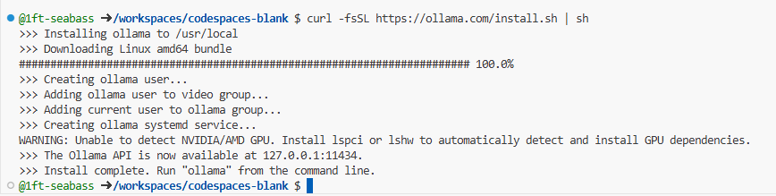
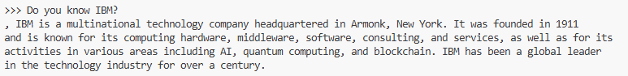

# Try Ollama + Code Engine + Granite


Ollama can ease to use IBM published open sourse LLM named IBM Granite.


Ollama'blog article also inform IBM Granite 3.0 model collaboration in https://ollama.com/blog/ibm-granite .

## Let's launch GitHub CodeSpaces

This article explain in my 2024/11/08 knowledge.

Please launch GitHub CodeSpaces on a latest Google Chrome browser.


First, login as your GitHub account. Then, click "Blank" template https://github.com/codespaces/templates .

This operation will open a CodeSpace at new browser tab.

Please wait launching GitHub CodeSpaces for a moment.


Launched!

## Let's install Ollama

The https://github.com/ollama/ollama article has the way of installing  Ollama.


The picture's a red border rect indicate Terminal for entering commands.

```
curl -fsSL https://ollama.com/install.sh | sh
```

Please type the above command and press Enter to run it.


If you copy and paste the command first, you get a clipboard confirming dialog. Please accept like this in the browser address area.


It progress installing...



It finished install.

## Let's launch Ollama

```
ollama serve
```

Please type the above command and press Enter to run it.


It launched Ollama server.

## Let's launch a new Terminal.


The terminal where the Ollama server was running at the time remains the same.

Please click the + button in the top right corner to start a new terminal.


It launched a new terminal.


These terminals can be switched using the UI on the right. Let's continue this time.

## Let's install MoE LLM model.

https://ollama.com/blog/ibm-granite has a lotp of curious LLMs. This time, let's try the Mixture of Expert (MoE) models for low latency.

```
ollama run granite3-moe
```

Please type the above command in the current new terminal and press Enter to run it.


It start downloading.


It continue downloading.


It prepared various preparations. It will say success. You will be able to sending a message!

## Let's try


Please type a message in this area.


Let's type "Do you know IBM?" and press Enter.



> , IBM is a multinational technology company headquartered in Armonk, New York. It was founded in 1911 
and is known for its computing hardware, middleware, software, consulting, and services, as well as for its 
activities in various areas including AI, quantum computing, and blockchain. IBM has been a global leader 
in the technology industry for over a century.

It will response like this message!

This trying has grate experience such fast downloading LLM data and fairly  fast responsing!