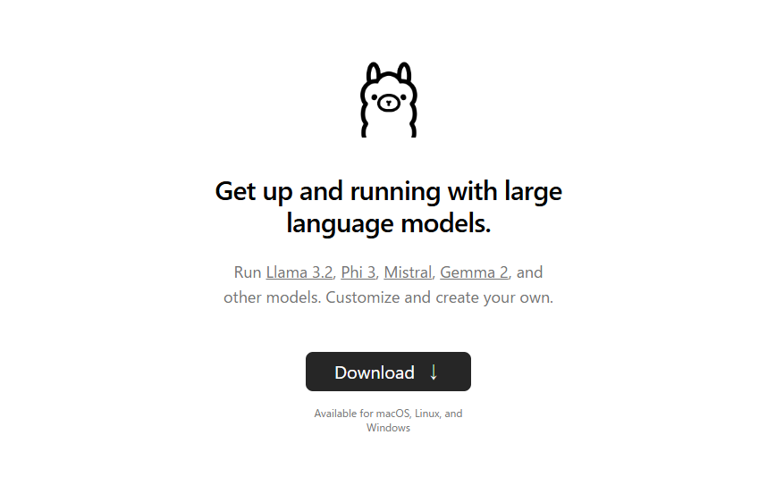
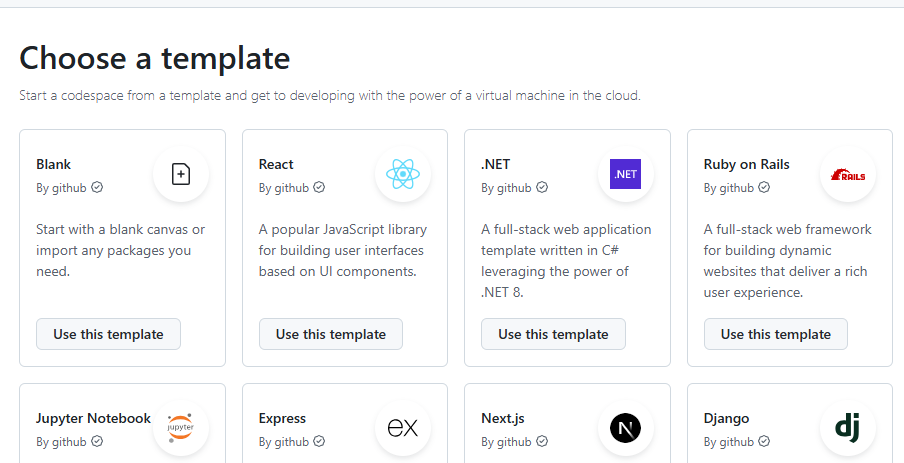
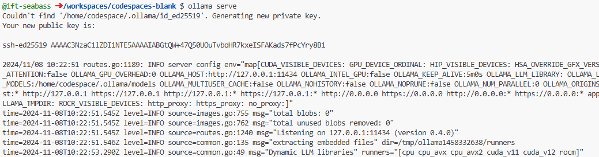
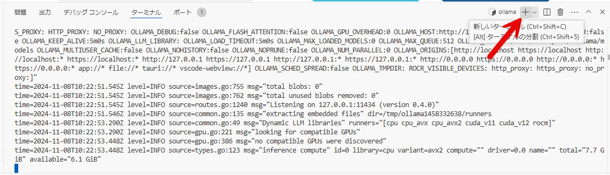
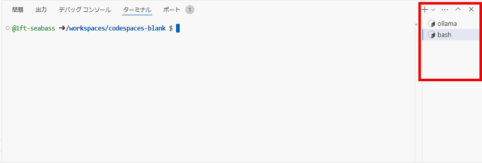
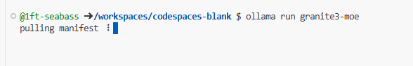
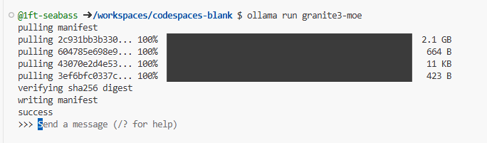

# Ollama + Code Engine + Granite モデルを試してみよう



Ollama で IBM が公開しているオープンソース LLM の IBM Granite を手軽に使うことが出来ます。


なんと Ollama のブログでも https://ollama.com/blog/ibm-granite でも IBM Granite 3.0 model とのコラボレーションについて紹介されています！

## GitHub CodeSpaces をシンプルに起動します

2024/11/08 時点での情報で進めます。

ブラウザは Chrome の最新版がおすすめです。



GitHub でログインした状態でテンプレート https://github.com/codespaces/templates から Blank をクリックします。

ブラウザで新しいタブで Codespace が起動します。起動を待ちます。


起動しました。

## Ollama インストール

https://github.com/ollama/ollama のインストール方法を参考に Ollama をインストールしていきます。


赤枠部分がこれからコマンドを入力するターミナルです。

```
curl -fsSL https://ollama.com/install.sh | sh
```

こちらのコマンドを入力して Enter キーを押して実行します。


最初にコピーアンドペーストするときにブラウザで許可が求められるので許可をクリックすると以後はペーストできます。


インストールが進行します。


インストールが完了しました。

## Ollama の起動

```
ollama serve
```

こちらのコマンドを入力して Enter キーを押して実行します。



これでサーバーが起動します。

## 新しいターミナルの起動



サーバーが起動しているターミナルは開きっぱなしにして、新しいターミナルを起動します。右上の＋ボタンをクリックして新しいターミナルを起動します。


新しいタブで新しいターミナルが起動しました。



ターミナルは右側の UI で切り替えることが出来ます。今回はこのままで OK です。

## MoE モデルのインストール

記事 https://ollama.com/blog/ibm-granite を見ると色々な種類があってワクワクしますが、ひとまず Mixture of Expert (MoE) models for low latency を使ってみます。

```
ollama run granite3-moe
```

先ほどの新しいターミナルで、こちらのコマンドを入力して Enter キーを押して実行します。



ダウンロードがはじまります。


ダウンロードを待ちます。



いろいろと準備がされます success となって質問が入力ができます！

## 試してみる


ここで入力してみます。


Do you know IBM? と入力してみます！


> , IBM is a multinational technology company headquartered in Armonk, New York. It was founded in 1911 
and is known for its computing hardware, middleware, software, consulting, and services, as well as for its 
activities in various areas including AI, quantum computing, and blockchain. IBM has been a global leader 
in the technology industry for over a century.

こんな回答が返ってきます！

ダウンロードも結構早くてコンパクトさを感じつつも、レスポンスもいい感じです！