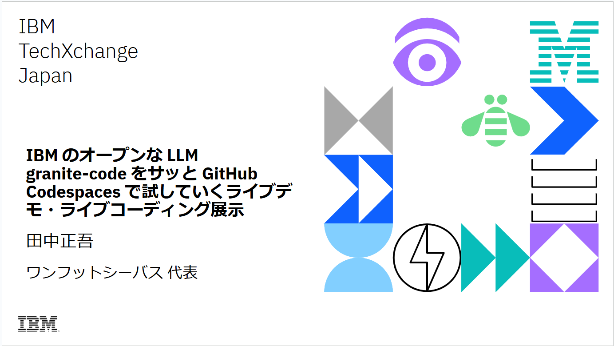

# ibm-techxchange24-japan-exhibition-granite-llm

This is the hands-on documents about IBM TechXchange Japan 2024 IBM Champion exibision booth "Live coding and live demo about Ollama + GitHub CodeSpaces + open source Granite LLM".

## The slide of the day

## Let's try!

→[Let's try! (English edition)](./00-simple-try-en.md)